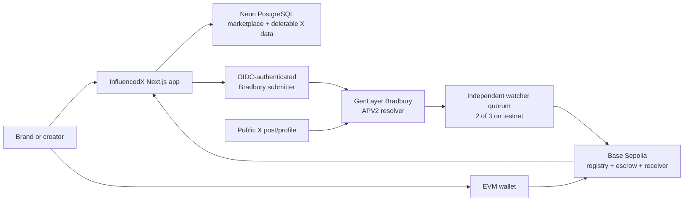

# InfluencedX

InfluencedX is an X-only creator marketplace. Brands publish campaigns and
escrow test USDC on Base Sepolia; verified creators apply, accept work, submit a
public X post, and have the frozen campaign rules evaluated on GenLayer
Bradbury.

**Live Preview:** [influencedx-preview.vercel.app](https://influencedx-preview.vercel.app)

The Preview is the current submission build. Marketplace discovery, wallet
authentication, creator verification, profiles, and campaign workflows are
live; automatic settlement services remain disabled until the documented
Preview key ceremony and simulation gate are completed.

> **Submission network:** Base Sepolia (`84532`) + GenLayer Bradbury + Base
> Sepolia test USDC. This is not a mainnet deployment, the assets have no
> monetary value, and the current 2-of-3 watcher relay is an explicit trust
> boundary rather than a native GenLayer-to-Base bridge.

The deployed ownership protocol intentionally retains the compatibility names
`XProof v2`, `XProofAttestationReceiver`, `XPROOF_*`, and `AdProof*`. Renaming
those identifiers would invalidate existing signatures, configuration, or
deployed-contract integrations; the user-facing product name is **InfluencedX**.

## Verified testnet evidence

| Component | Network | Address or transaction | Recorded state |
| --- | --- | --- | --- |
| APV2 ownership resolver | GenLayer Bradbury | `0x017311b35dbB9802883bDaE7Fb0Efd7Bd77cB0b2` | Deployment tx `0xcbad3920c328c5fd88e38a306683a90e23264d20f851944ef8a4ba19eb2b504b`; FINALIZED; eight-argument APV2 ABI |
| Creator registry | Base Sepolia | [`0x10079EF049D283BC3f212CCaC4291b3aC2719C48`](https://sepolia.basescan.org/address/0x10079EF049D283BC3f212CCaC4291b3aC2719C48) | Deployed and wired to the receiver |
| Campaign escrow | Base Sepolia | [`0x7e9B6B757d1Ef12509889826B2f2A42906661927`](https://sepolia.basescan.org/address/0x7e9B6B757d1Ef12509889826B2f2A42906661927) | Deployed with 250 bps test fee |
| Attestation receiver | Base Sepolia | [`0x15dDbCd98F97065746a1c35f88BB670a7A942264`](https://sepolia.basescan.org/address/0x15dDbCd98F97065746a1c35f88BB670a7A942264) | Current resolver pinned; three watchers; threshold two |
| Test USDC | Base Sepolia | [`0x036CbD53842c5426634e7929541eC2318f3dCF7e`](https://sepolia.basescan.org/address/0x036CbD53842c5426634e7929541eC2318f3dCF7e) | Six-decimal test token only |
| Live ownership proof relay | Base Sepolia | [`0x0b26bffd19643ea816b740432c0293eee26bccbf6b0b7cb0407cb1c3063c6406`](https://sepolia.basescan.org/tx/0x0b26bffd19643ea816b740432c0293eee26bccbf6b0b7cb0407cb1c3063c6406) | Created active registry profile `1` for `0x63038a310a46AC61A59c1bC5eAD5fe41040eF38e` |

The immutable deployment records are
[`deployments/base-sepolia.json`](deployments/base-sepolia.json) and
[`deployments/genlayer-bradbury.json`](deployments/genlayer-bradbury.json).
Never infer a live result from the interface alone; verify the receipt or API
state before presenting a campaign as funded, verified, paid, or refunded.

## Architecture



- **Base Sepolia is authoritative** for wallet-to-X commitments, campaign
  agreements, test-USDC custody, lifecycle events, and settlement accounting.
- **GenLayer Bradbury is authoritative** for interpreting public X evidence
  against the immutable ownership or campaign rules.
- **PostgreSQL is authoritative only for application state** that does not
  belong onchain: campaign discovery, pitches, sanitized public metrics, sealed
  evidence, and reconciliation state.
- **X is an external availability dependency.** No OAuth is used. A protected,
  deleted, rate-limited, or ambiguous source must resolve to `UNDETERMINED`, not
  an automatic creator failure.

See [the detailed architecture](docs/ARCHITECTURE.md),
[the APV2 ownership specification](docs/OWNERSHIP-V2.md), and
[the verification report](docs/TEST-REPORT.md).

## Complete user flow

1. A user connects an EVM wallet and signs a short-lived login challenge. The
   server binds its HttpOnly session to that wallet; the user can sign out and
   switch wallets explicitly.
2. A creator requests an APV2 challenge, publishes the exact one-time text from
   the X account, and submits the canonical `x.com/<handle>/status/<id>` URL.
3. GenLayer validators retrieve the public post and profile, derive the immutable
   numeric X identity, and finalize a structured ownership result. A watcher
   quorum relays the verified commitment to the Base creator registry.
4. A brand creates a campaign with deliverables, disclosure rules, required and
   forbidden phrases, semantic brief, budget, and deadlines. The server freezes
   those fields into an exact terms document and hash.
5. The brand approves the exact test-USDC amount and creates the campaign in the
   Base escrow. InfluencedX records `funded` only after verifying the receipt and
   `CampaignCreated` event.
6. A verified creator applies with a pitch and requested rate. The owning brand
   can see its applications; another viewer cannot enumerate private pitches.
7. The brand selects an application through a prepared Base transaction and the
   creator accepts the resulting agreement through a second Base transaction.
   Each database transition occurs only after its exact receipt is confirmed.
8. The creator publishes the work on X and submits its canonical post URL. Base
   stores commitments, not the raw post text; the receipt moves the campaign to
   `submitted`.
9. After the retention period, the brand or creator requests resolution on Base.
   The app confirms that receipt, then queues and polls the exact request through
   the Bradbury submitter without accepting caller-controlled resolver methods or
   arguments.
10. After GenLayer finality, independent watchers sign the frozen result and the
    Base receiver settles PASS, FAIL, or retryable UNDETERMINED. The current
    testnet package keeps this watcher-quorum submission as an explicit operator
    boundary; do not claim automatic settlement unless that final Base receipt is
    visible.

## Local setup and validation

Requirements: Node.js 24, npm, PostgreSQL/Neon for live marketplace mutations,
Python for direct GenLayer tests, and the GenLayer CLI/GenVM linter for contract
deployment checks.

```powershell
cd C:\path\to\adproof
npm ci
npm run contracts:compile
npm run test:base
npm run test:relay
npm run test:operator
npm run test:services
npm run test:submitter

cd web
npm ci
Copy-Item .env.example .env.local
npm run db:migrate
npm run db:verify
npm test
npm run lint
npm run dev
```

Fill the copied `.env.local` only on the developer machine or through the hosting
provider's encrypted environment store. Never commit `.env.local`, `.secrets/`,
password files, private keys, keystores, Vercel metadata, or runtime reports.
The committed `.env.example` files contain names and safe public testnet values
only.

Optional GenLayer checks from the repository root:

```powershell
python -m pytest tests/direct -v
genvm-lint check contracts/genlayer/AdProofXResolver.py
```

## Continuous integration

- [`ci.yml`](.github/workflows/ci.yml) runs only deterministic, secret-free
  protocol, web, Bradbury submitter, campaign relay, and watcher checks on Node
  24. It has read-only repository permission and no migration, deployment,
  signer, live-RPC, or broadcast command.
- [`x-stress.yml`](.github/workflows/x-stress.yml) is a separate scheduled/manual
  public-X availability regression. It persists only the sanitized stress
  report artifact and is intentionally excluded from pull-request CI.

## Submission and operations

- [Three-minute demo script and recording checklist](docs/DEMO-SCRIPT.md)
- [Deployment and rollback runbook](docs/DEPLOYMENT.md)
- [Preview ownership relay runbook](docs/preview-base-sepolia-relay.md)
- [Watcher-key separation](docs/WATCHER-KEYS.md)
- [Web runtime and environment gates](web/README.md)

The repository demonstrates a production-oriented architecture on testnets. It
does **not** claim a mainnet launch, independent audit, native cross-chain proof,
or safe custody of real funds.
