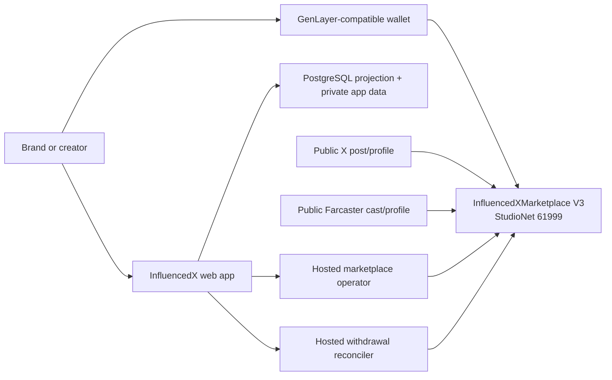

# InfluencedX

InfluencedX is a creator marketplace whose active V3 reviewer preview runs entirely on
GenLayer. Brands escrow native GEN in a campaign; creators prove an X or
Farcaster identity, apply for work, publish the required post or cast, and let
GenLayer validators evaluate the frozen campaign terms. PASS, FAIL, and
retryable UNDETERMINED outcomes settle inside the same Intelligent Contract.

> **Current network:** GenLayer StudioNet (`61999`) with developer-network GEN.
> StudioNet is temporary and resettable. This repository does not claim a
> mainnet launch or that StudioNet GEN has monetary value.

The active contract is
[`InfluencedXMarketplace.py`](contracts/genlayer/InfluencedXMarketplace.py),
deployed at
[`0x492175c248168DDB9571CBF4c6A14296e3348181`](https://explorer-studio.genlayer.com/address/0x492175c248168DDB9571CBF4c6A14296e3348181).
The immutable deployment record is
[`deployments/genlayer-studionet.json`](deployments/genlayer-studionet.json).

## Release status

The corrected contract source is deployed as V3. The native web/API, database
projections, marketplace operator, and restricted withdrawal reconciler are
pinned to this exact address in the reviewer Preview at
[`influencedx-native-preview.vercel.app`](https://influencedx-native-preview.vercel.app).
The V3 maintenance generation is active, and live checks confirm the page and
campaign projection expose V3 without leaking V2 state. A finalized canary
proves atomic X + Farcaster identity activation and the complete funded
campaign, submission, resolution, withdrawal, emitted transfer, and on-chain
confirmation path. See [the V3 reviewer evidence](reports/studionet-v3-review-evidence-20260904.md).
The previous V2 deployment is retained only as a rollback reference.

## Active StudioNet reviewer deployment

| Setting | Value |
| --- | --- |
| Network | `studionet` |
| Chain ID | `61999` |
| RPC | `https://studio.genlayer.com/api` |
| Explorer | `https://explorer-studio.genlayer.com` |
| Marketplace V3 | `0x492175c248168DDB9571CBF4c6A14296e3348181` |
| Deployment transaction | `0x3e3b7e8a10ab46c5e19638c3efd6816d78911d10213188571cbd4393f6494da8` |
| Deployed at | `2026-09-04T13:28:21.338118Z` |
| Source SHA-256 | `0x6e97a6f97ff96af9cd14f2b06e0ac86db4b2965b1bba49f4e7548dd77fe6f2e6` |
| ABI / direct suite | `53` methods / `64` tests passed |
| Protocol / storage | `INFLUENCEDX_MARKETPLACE_V3` / `3` |
| Native asset | `GEN`, 18 decimals |
| Protocol fee | `250` bps, snapshotted per campaign |
| Resolution recovery | `900` seconds |
| Withdrawal recovery | `86400` seconds |
| Upgrade delay | `604800` seconds (seven full days) |

The deployment transaction reached `FINALIZED` with `MAJORITY_AGREE` and a
successful leader return. The manifest also records the owner, treasury,
dedicated upgrade administrator, restricted withdrawal confirmer, source hash,
full lifecycle evidence, and prior deployments. Do not
copy addresses from prose into runtime configuration without comparing the
manifest and live `get_config()` result.

The prior pre-public deployment `0xEaCeBa807a7A4dc370f3B5a8e45539596b8551b4`
(transaction `0x8881290fcbe992a222995fccc0f2994e3752bd4e4aad35e6d25628e3c6df21d2`)
is retired. Its Farcaster verification requested 100 recent casts, above the
provider's defined limit. The replacement requests 50, and its companion
backend release reads immutable transaction creation time instead of a moving
current timestamp when enforcing finality age.

## Active architecture



- **GenLayer is authoritative** for source-keyed creator identities, campaign
  terms, native GEN custody, applications, assignments, evidence, consensus
  resolution, credits, fees, refunds, withdrawals, and the upgrade schedule.
- **Users sign their own writes.** The server prepares an exact contract call;
  the connected wallet signs it; the backend accepts the state transition only
  after matching sender, contract, method, arguments, native value, finalized
  receipt, and resulting contract state.
- **PostgreSQL is a projection and application store.** It holds sessions,
  private pitches, idempotency records, queue state, and deletable supporting
  data. It never replaces authoritative contract state or custody.
- **The marketplace operator is permissionless maintenance automation.** Its
  dedicated StudioNet key can call only `resolve_assignment`,
  `expire_assignment`, and `finalize_campaign`, always with zero value.
- **The withdrawal reconciler uses a separate restricted confirmer.** It proves
  the exact finalized native child transfer before it can call only
  `confirm_withdrawal`. Ambiguity is quarantined for manual review.
- **X and Farcaster are availability dependencies.** Ambiguous or transient
  retrieval resolves to UNDETERMINED, not an automatic creator loss.

See [the V3 reviewer evidence](reports/studionet-v3-review-evidence-20260904.md)
and [the StudioNet boundary](docs/STUDIONET.md).

## Product flow

1. A user connects a GenLayer-compatible wallet and signs a short-lived login
   challenge. The server binds the HttpOnly session to that address.
2. A creator publishes one X challenge post and one Farcaster challenge cast,
   then signs `activate_identity_bundle` once. Validators verify both sources
   and atomically bind the stable X user ID and Farcaster FID.
3. A brand defines a source-specific campaign. `create_campaign` receives the
   exact budget as native call value, freezes the terms, and holds GEN in V3.
4. A creator with both identities active applies. The brand selects a
   creator, who accepts and later commits the X post ID or Farcaster cast hash.
5. After retention, the hosted operator calls the fixed permissionless
   resolution method. Validators retrieve the frozen source and evaluate exact
   and semantic requirements.
6. PASS credits the creator minus the snapshotted fee; FAIL credits the brand;
   UNDETERMINED follows bounded retry and refund rules. Funds remain pull-based.
7. A user requests and executes a withdrawal. The reconciler proves the exact
   child native transfer and its restricted confirmer records it on V3. Only contract status
   `CONFIRMED` is displayed as delivered.

## Local validation

Requirements are Node.js 24, npm, Python 3.13, PostgreSQL/Neon for database
checks, the GenLayer CLI, and the GenVM linter.

```powershell
cd C:\path\to\adproof
python -m pip install --requirement requirements-direct.txt
genvm-lint check contracts/genlayer/InfluencedXMarketplace.py --json
python -m pytest tests/direct -q

cd web
npm ci
Copy-Item .env.example .env.local
npm run lint
npm test

cd ..\services\vercel-genlayer-marketplace-operator
npm ci
npm run lint
npm test
npm run build

cd ..\vercel-genlayer-withdrawal-reconciler
npm ci
npm run lint
npm test
npm run build
```

`tests/integration/` contains network-mutating StudioNet checks and is not part
of deterministic CI. Run it only with an explicitly selected, disposable,
funded StudioNet account and record every resulting hash.

Copy [the web environment template](web/.env.example) and fill secrets only in
the hosting provider's encrypted environment store or an ignored local file.
Never commit `.env.local`, `.secrets/`, private keys, wallet exports, database
URLs, service tokens, Vercel metadata, or runtime reports.

## Active versus historical commands

The root `package.json` still contains Solidity, Base Sepolia, watcher, relay,
and legacy submitter commands so the former prototype can be reproduced and
audited. They are **historical tests and operators, not V3 deployment steps**.
In particular, do not run `deploy:base-sepolia`, `cutover:base:studionet`,
`brand:fund:base-sepolia`, `settlement:*`, `relay:*`, or `test:services` when
operating the GenLayer-only product. V3 operations use the contract, web app,
marketplace operator, and withdrawal reconciler named above.

Historical Base/USDC/watcher evidence is isolated in
[`docs/preview-base-sepolia-relay.md`](docs/preview-base-sepolia-relay.md),
[`docs/campaign-settlement-services.md`](docs/campaign-settlement-services.md),
[`docs/WATCHER-KEYS.md`](docs/WATCHER-KEYS.md), and
[`deployments/base-sepolia.json`](deployments/base-sepolia.json). None of those
files is active V3 runtime configuration.

## Operations and submission

- [Deployment, cutover, rollback, and reset runbook](docs/DEPLOYMENT.md)
- [Current V3 reviewer evidence](reports/studionet-v3-review-evidence-20260904.md)
- [Legacy V2 three-minute demo checklist](docs/DEMO-SCRIPT.md)
- [Marketplace operator service](services/vercel-genlayer-marketplace-operator/README.md)
- [Withdrawal reconciler service](services/vercel-genlayer-withdrawal-reconciler/README.md)

The current StudioNet deployment is suitable for developer-network testing,
not real-value custody. A future mainnet release requires fresh network-scoped
deployment records, production signer governance, independent security review,
operational monitoring, backup/restore drills, and a complete value-transfer
rehearsal on the target network.
