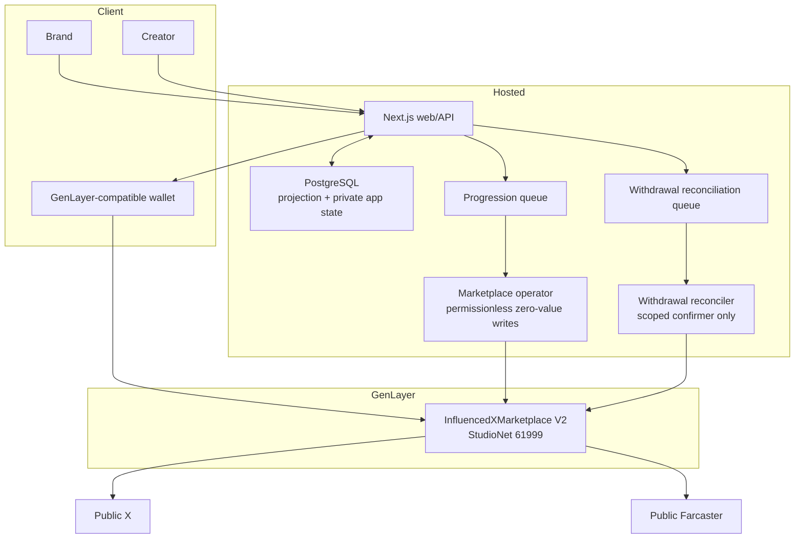
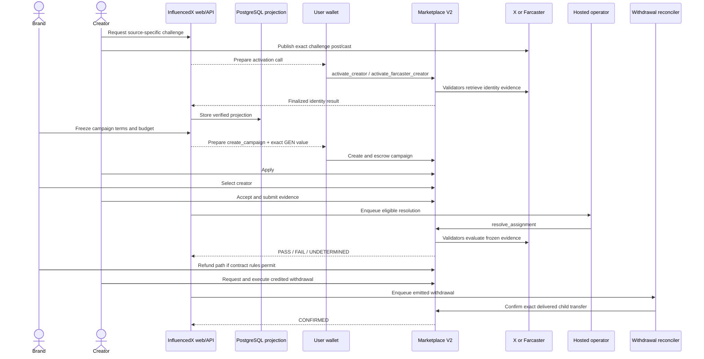

# InfluencedX GenLayer-only architecture

InfluencedX V2 has one protocol authority:
[`InfluencedXMarketplace.py`](../contracts/genlayer/InfluencedXMarketplace.py).
Creator identity, campaign custody, lifecycle, consensus resolution, credits,
refunds, fees, withdrawals, and governance all live on GenLayer. Base, USDC,
watchers, and the former cross-network relay are not part of active V2.

## System map

## Authority and trust boundaries

### GenLayer contract

The contract is authoritative for:

- wallet-bound X identities keyed by stable numeric X user ID;
- wallet-bound Farcaster identities keyed by stable FID;
- immutable, source-specific campaign terms and native GEN escrow;
- application commitments and assignment agreements;
- X post IDs or Farcaster cast hashes submitted as evidence;
- validator consensus outcomes and deterministic evidence hashes;
- per-campaign accounting, protocol fees, claimable credits, refunds, and
  withdrawal state;
- owner, treasury, pause state, and the seven-day code-upgrade schedule.

One wallet can bind both sources. A campaign freezes exactly one
`content_source`, and its assignment freezes that source's stable identity.
Changing a handle or username cannot substitute another stable identity.

### Wallet and browser

Users authorize their own economic and identity actions. The web server returns
a prepared call containing the exact StudioNet chain, V2 address, method,
ordered arguments, argument types, and native value. The wallet signs and sends
the transaction directly to GenLayer.

Confirmation is not “the browser returned a hash.” The backend loads a finalized
transaction and verifies all of the following before updating its projection:

1. sender equals the wallet-bound session;
2. recipient equals the pinned V2 contract;
3. method and canonical ordered arguments match the prepared record;
4. native value is exact (`budget_atto` only for `create_campaign`, otherwise
   zero);
5. lifecycle is `FINALIZED`, consensus is `MAJORITY_AGREE`, and the unique
   leader receipt reports `SUCCESS` plus `return`; and
6. the resulting contract record matches the intended state transition.

### Web and PostgreSQL

PostgreSQL is not an alternate ledger. It stores:

- wallet-bound HttpOnly sessions and short-lived challenges;
- private pitches whose hashes are committed onchain;
- immutable prepared-call envelopes and confirmation idempotency records;
- deployment-scoped campaign/assignment/profile projections;
- queue progression and reconciliation state;
- deletable, non-authoritative source previews and operational metadata.

Every projection is scoped by network, chain ID, contract address, protocol
version, and storage schema so a StudioNet reset or V3 deployment cannot be
silently combined with V2 state.

### Hosted marketplace operator

The operator has a dedicated StudioNet key with no governance role. Its adapter
accepts only three fixed operations:

- `resolve_assignment(assignment_id, request_id)`;
- `expire_assignment(assignment_id)`; and
- `finalize_campaign(campaign_id)`.

The caller cannot choose a target, arbitrary method, raw arguments, or value.
The service re-reads V2 pre-state, uses durable idempotency and a fenced signer
gate, requires exact finalized receipt bindings, and re-reads post-state. An
unknown broadcast result is quarantined instead of retried with another hash.

### Hosted withdrawal reconciler

Native withdrawals are deliberately two-phase because a parent GenLayer call
and its external value-transfer child must be reconciled. The user first signs
`request_withdrawal`, then `execute_withdrawal`. V2 records
`EMITTED_UNCONFIRMED`; that is not a delivered payment.

The separate reconciler derives the recipient and amount from V2, proves the
unique finalized child transfer and exact credited value, repeats discovery
under a signer fence, and can call only
`confirm_withdrawal(withdrawal_id, evidence_hash)` with zero value. Only the
resulting `CONFIRMED` contract state is presented as delivered. Missing,
contradictory, or ambiguous evidence becomes a manual reconciliation alert.
The service never automatically restores a withdrawal or recapitalizes funds.

### X and Farcaster

Both sources remain outside the protocol's availability control. Validators
retrieve public evidence independently:

- X ownership binds the public challenge post and derives the stable X user ID;
- Farcaster ownership binds the public challenge cast, username proof, FID, and
  cast hash;
- campaign resolution retrieves the frozen source and content ID.

Authentication failures, rate limits, malformed success responses,
inconsistent providers, or unavailable timestamps are UNDETERMINED. Definitive
missing evidence may become FAIL only under the contract's explicit provider
and retention rules. This fail-safe boundary prevents a transient platform
outage from automatically taking a creator's campaign credit.

## Lifecycle

## Accounting model

Campaign creation is payable and must satisfy
`gl.message.value == budget_atto`. One GEN is `10^18` atto-GEN. The fee and
treasury are snapshotted at campaign creation so later governance changes do
not rewrite an existing agreement.

PASS credits the creator's agreed rate minus the fee and credits the treasury.
FAIL credits the brand. Unallocated and contract-authorized UNDETERMINED paths
also credit the brand. Credits are pull-based and never marked externally
delivered before reconciliation.

The contract checks both per-campaign and global conservation after every value
transition. See [the V2 protocol reference](GENLAYER-MARKETPLACE.md) for states
and invariants.

## Governance and upgrades

The V2 owner controls pause, fee, treasury, withdrawal-confirmer rotation,
two-step owner transfer, and the exceptional withdrawal recovery process. A
narrowly scoped `withdrawal_confirmer` can only finalize evidence-bound
withdrawal delivery; it cannot administer the protocol. A separate
`upgrade_admin` controls GenVM Root upgrades.

An upgrade requires:

1. the marketplace is paused;
2. the upgrade administrator schedules the exact SHA-256 of the candidate
   source;
3. at least `604800` seconds elapse;
4. the marketplace remains paused; and
5. execution supplies code whose bytes exactly match the scheduled hash.

The owner or upgrade administrator can cancel. Rescheduling restarts the full
delay. Storage must remain append-only and the constructor does not rerun.

The StudioNet owner and upgrade administrator are EOAs for developer-network
testing. Mainnet requires reviewed multisignature or governance boundaries and
must not reuse these keys.

## Failure handling

| Failure | Required behavior |
| --- | --- |
| Wallet rejected or wrong call | Do not mutate the database projection; prepare a fresh exact call only if still eligible. |
| Transaction pending | Poll the same hash; never submit an alternate write automatically. |
| Finalized contract error | Show sanitized error and keep authoritative pre-state. |
| Operator unknown broadcast | Fence signer and enter manual reconciliation. |
| Source unavailable | Preserve UNDETERMINED/retry path; never infer FAIL. |
| Withdrawal evidence ambiguous | Keep `EMITTED_UNCONFIRMED`; alert manual operations. |
| Hosted release broken | Disable mutation/automation gates and roll web back; never roll chain state back. |
| StudioNet reset | Freeze mutations, deploy a fresh contract, create a new manifest/projection scope, and run fresh E2E. |

## Historical archive boundary

The former architecture used Base Sepolia, test USDC, a separate APV2 resolver,
watchers, and a relay. Its code and receipts are retained for auditability only:

- [historical Base relay record](preview-base-sepolia-relay.md);
- [historical settlement services](campaign-settlement-services.md);
- [historical watcher-key model](WATCHER-KEYS.md); and
- [historical Base deployment manifest](../deployments/base-sepolia.json).

None is an active dependency, deployment step, secret, queue, or trust boundary
for GenLayer Marketplace V2.
