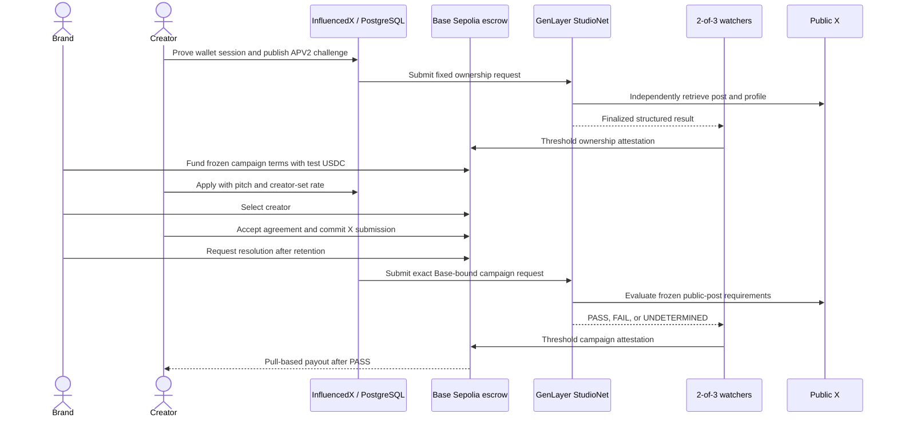

# InfluencedX architecture

## Consensus boundary

User action -> public X URL -> GenLayer validators independently retrieve the
post/profile -> the Intelligent Contract applies explicit equivalence rules ->
a finalized structured result is observed by threshold relay watchers -> Base
Sepolia changes escrow or identity state.

### Frontend/backend owns

- Search, profiles, applications, campaign drafts, notifications, and messages.
- Generation and expiry of single-use APV2 X verification challenges, followed
  by post-ID-bound request finalization after publication.
- Deletable copies of X handles, post text, metrics, and evidence previews.
- Indexing Base and GenLayer events and preparing threshold attestations.
- Non-authoritative estimated-pay previews.
- Wallet-session challenges, explicit sign-out/switch-wallet behavior, and
  receipt reconciliation for every marketplace lifecycle transition.

### GenLayer owns

- Whether a public X post contains the exact wallet, challenge, and validity
  markers and was authored by the expected handle.
- The immutable numeric X user ID and its identity commitment, derived from the
  public profile during validator consensus rather than supplied by the caller.
- A structured public profile snapshot, including explicit insufficiency when
  public evidence is unavailable.
- Whether a submitted campaign post satisfies the frozen public requirements.
- Stable request/result identifiers consumed by relay watchers.

### Base owns

- Wallet-to-X identity commitments, never raw X handles or post text.
- Campaign and accepted-agreement hashes.
- Test USDC custody, accounting, settlement, and pull-based withdrawals.
- Replay protection and the threshold signer policy for relayed results.

### External sources own

- X owns the source post/profile and can edit, remove, restrict, or rate-limit
  it. Retrieval failure must produce `UNDETERMINED`, not an automatic creator
  failure.

No X OAuth is used. Account ownership is proven by an original public APV2
challenge post containing the creator's checksummed full Base wallet, random
challenge, issue time, challenge expiry, and credential expiry. After
publication, the request
ID binds those fields to the X post ID. GenLayer derives the immutable numeric X
user ID; neither the browser nor backend may assert it. A handle change does not
change the derived identity commitment. Protected accounts are rejected because
independent validators cannot retrieve the same public evidence.

Follower count, account age, recent post engagement, view medians, and sample
consistency feed a versioned estimated-pay range. The estimate is marketplace
guidance only: creators choose their application price and brands choose whom
to hire. These metrics can raise manipulation warnings but do not prove that
engagement is genuine.

## Identity flow

1. Backend creates a random APV2 challenge bound to a Base wallet, expected
   handle, issue time, challenge expiry, and credential expiry. No X user ID or
   request ID exists yet.
2. Creator publishes the exact challenge text in an original public X post.
3. Backend extracts the post ID and computes the normalized, post-bound APV2
   request ID.
4. GenLayer recomputes that request ID, fetches the direct X URL, oEmbed, and
   profile, then derives the immutable X user ID and identity hash.
5. Validators compare stable decision fields: request, author, post ID, exact
   markers, derived identity, publication time, and outcome.
6. Threshold watchers sign the finalized GenLayer result.
7. `AdProofAttestationReceiver` verifies the watcher quorum and calls
   `AdProofCreatorRegistry`.

The exact challenge envelope and resolver ABI are specified in
[OWNERSHIP-V2.md](OWNERSHIP-V2.md).

## Campaign flow

1. The backend validates campaign fields, freezes deliverables, semantic brief,
   disclosure and phrase rules, deadlines, budget atomics, and Base addresses in
   one canonical terms document, then derives its hash.
2. The brand approves the exact Base Sepolia test-USDC amount and creates the
   campaign on Base. The API records funding only after verifying the receipt
   and event against that persisted terms document.
3. Applications remain in PostgreSQL, scoped to the authenticated wallet. Only
   the owning brand can enumerate pitches; a creator sees its own application.
4. The brand selects a verified creator through a prepared Base transaction and
   the creator accepts the exact agreement through another Base transaction.
5. The creator submits a canonical X post URL. Base stores commitments rather
   than raw X content; the API confirms the exact submission event.
6. After the retention interval, Base emits a deterministic resolution request.
7. The app queues only that persisted request through the isolated StudioNet
   submitter. The public route accepts no caller-controlled method or resolver
   arguments and polls idempotently to a terminal lifecycle.
8. GenLayer resolves the public post against the frozen rules.
9. Threshold watchers independently read and sign the finalized result.
10. The Base receiver pays the creator or credits the brand. `UNDETERMINED` can
    be retried. In the current testnet package, the final watcher submission is
    an explicit operator boundary and must not be described as automatic unless
    its Base receipt is present.

## Bridge migration

The escrow depends only on an `attestationReceiver` address. The current
receiver requires M-of-N EIP-712 watcher signatures. It can later be replaced
with a receiver backed by a verified GenLayer/Base messaging protocol without
changing campaign accounting.

The testnet receiver is deliberately a 2-of-3 EIP-712 threshold relay. Each
watcher independently reads a FINALIZED StudioNet result, rebuilds the exact
typed payload, and signs on a separate host. The Base submitter rejects duplicate
or unauthorized signers, the receiver rejects non-allowlisted resolver sources,
and each request ID is consumed once. The contract will not permit fewer than
three watchers or a threshold below two. This is an explicit trust boundary,
not a claim that Base currently verifies GenLayer consensus directly.

StudioNet is a gasless, temporary developer network whose state may be reset.
That makes it suitable for the submission rehearsal, but not a durable
production ledger. A later persistent-network cutover requires a new resolver,
receiver-source update, environment migration, and fresh end-to-end proofs.

## Data minimization

On Base store only hashes/commitments, addresses, amounts, timestamps, and
outcomes. PostgreSQL rows containing X-derived data include deletion timestamps
and source-status fields so content can be removed without attempting to mutate
blockchain history.

The PostgreSQL purge migration deletes challenges and metric evidence, removes
stored X IDs/handles/post URLs, and retains only commitments needed to reconcile
immutable chain state.
